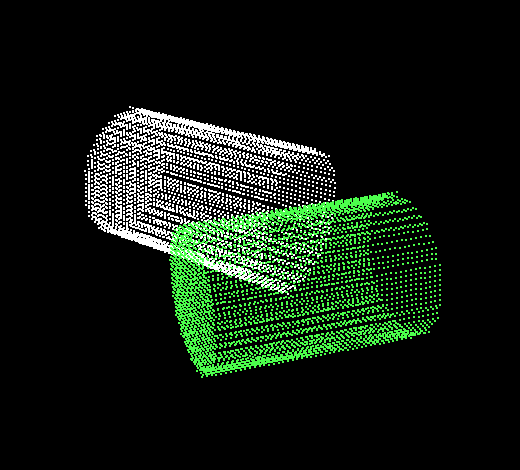
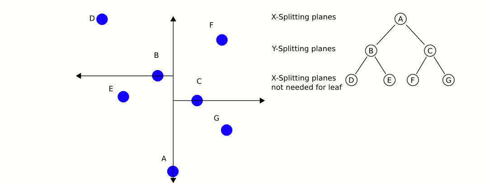
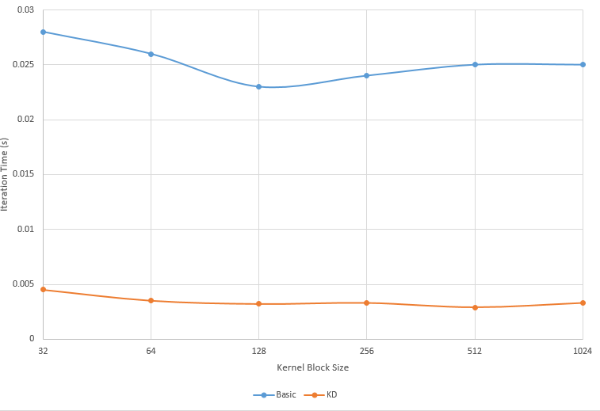
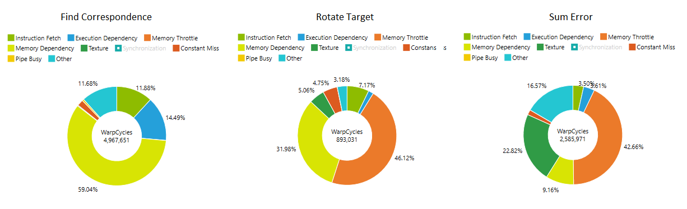
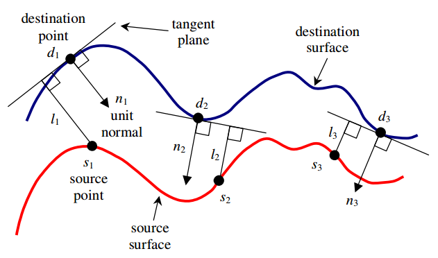

**University of Pennsylvania, CIS 565: GPU Programming and Architecture,
Project 4 - GPU Accelerated ICP **

* Michael Willett
* Tested on: Windows 10, I5-4690k @ 3.50GHz 16.00GB, GTX 750-TI 2GB (Personal Computer)

## Contents
1. [Introduction](#intro)
2. [Naive Solution](#part1)
3. [Neighborhood Search](#part2)
4. [Performance Analysis](#part3)
5. [Development Process](#part4)
6. [Build Instructions](#appendix)

<a name="intro"/>
## Introduction: Point Cloud Registration
Increasingly with both desktop and embedded applications the need for robust pointcloud registration has
been growing in demand. The prevalence of cheap camera technology, integration into popular gaming platforms,
augmented reality systems, and affordable robot vision sensors all rely on accurately aligning objects seen 
from depth cameras between each frame. As these cameras frequently are recording at 30-60 Hz, real-time processing
of this data is important unless the developer chooses to sub-sample the frames, potentially losing data and
reducing tracking accuracy.

This project provides three variations on the traditional Iterative Closest Point (ICP) algorithm: brute force
CPU implementation, brute force GPU implementation parallelized over each point in the target pointcloud, and 
improved GPU implementation using KD-tree sorting of points in the scene.

<a name="part1"/>
## Section 1: ICP Algorithm and Limitations

The ICP algorithm can be broken into four basic steps:

1. For each point in the target pointcloud, find the closest point in the scene pointcloud.
2. Compute a 3d tranformation matrix that best aligns the points using Least-Squares-Regression.
3. Update all points in the target by the computed transformation matrix.
4. Repeat steps 1-3 until desired level of convergence.

Fortunately, the least-squares problem can be efficiently reduced using singular value decomposition of a single matrix.
As a result, the largest limitation of the ICP algorithm is the number of points. For a scene with N points, and a target
with M points, complexity becomes O(N*M) due to the nearest neighbor search.

Fortunately, this process is embarisingly parallel, so GPU implemenation reduces to linear time O(N) when run in parallel
over all points in the target, with only the addition of memory overhead. Furthermore, the nearest neighbor search can be 
reduced to O(log n) if the target points are sorted into a KD-tree before running ICP.

**3D KD-Tree (left) and nearest neighbor search (right)**

The biggest limitation of ICP, however, is that it does not guarantee convergence to a global minima, and can have poor
alignment accuracy for simple models, or pointclouds with large initial offsets. Below is an example of trying to align
two pointclouds of the same box with large initial offsets. The final result shows good general alignment, it gets stuck
with about a 5 degree rotational error and never full converges to perfect alignment.

Similarlly, when using a point cloud generated from a microsoft kinect looking down a hallway, we see good general alignment,
however, the point cloud appears to have shift too far along the length of the hallway.

<a name="part2"/>
## Section 2: Runtime Performance
*Iteration timers were run using glfwGetTime to get the system time. GPU thread analysis run using NVIDIA Nsight tools.*

<a name="part3"/>
## Section 3: Further Improvements
Several methods have been proposed to reduce local minima errors in the basic ICP implementation. The most significant of
which is to use a point-to-plane distance metric when finding correspondences. The idea is that rather than taking the
euclidean distance between two points, you calculate the distance from a source point to the tangent plane of the target
point cloud. This has empircally been shown to have siginificantly better convergence rates at the cost of longer iterations,
but has the advantage that parallel surfaces will slide along one another, reducing local minima cases as scene in the box
example. Additionally, this method requires computation of point cloud normals as well as more complicated non-linear 
least-squares reduction algorithm.

Additonally another common technique is to transform input pointclouds using scale invariant feature transforms. The idea
is to precompute a reduced set of points that encapsulate more informative data about the object geometry per point without 
losing accuracy from naive subsampling. A simple example would be 3D edge detection. Adding these features, as well as weighting 
the importance for correlations by other metrics such as voxel color have shown significant improvements for alignment accuracy
at the additional cost of upfront calculations.

<a name="appendix"/>
## Appendix: Build Instructions
* `src/` contains the source code.

Pointclouds are loaded at run time by passing in two plain text files as command line arguments. File format is one point
per line, separated by commas (e.g. "1, 2, 3 \n 4, 5, 6 \n").

This code uses Eric Jang's Fast 3x3 SVD library provided from his GitHub page to generate rotations updates for each step
(https://github.com/ericjang/svd3).

**CMake note:** Do not change any build settings or add any files to your
project directly (in Visual Studio, Nsight, etc.) Instead, edit the
`src/CMakeLists.txt` file. Any files you add must be added here. If you edit it,
just rebuild your VS/Nsight project to make it update itself.

**If you experience linker errors on build related to the compute capability during thrust calls, edit the project to include the CUDA
library 'cudadevrt.lib'**

#### Windows

1. In Git Bash, navigate to your cloned project directory.
2. Create a `build` directory: `mkdir build`
   * (This "out-of-source" build makes it easy to delete the `build` directory
     and try again if something goes wrong with the configuration.)
3. Navigate into that directory: `cd build`
4. Open the CMake GUI to configure the project:
   * `cmake-gui ..` or `"C:\Program Files (x86)\cmake\bin\cmake-gui.exe" ..`
     * Don't forget the `..` part!
   * Make sure that the "Source" directory is like
     `.../Project4-Iterative-Closest-Point`.
   * Click *Configure*.  Select your version of Visual Studio, Win64.
     (**NOTE:** you must use Win64, as we don't provide libraries for Win32.)
   * If you see an error like `CUDA_SDK_ROOT_DIR-NOTFOUND`,
     set `CUDA_SDK_ROOT_DIR` to your CUDA install path. This will be something
     like: `C:/Program Files/NVIDIA GPU Computing Toolkit/CUDA/v7.5`
   * Click *Generate*.
5. If generation was successful, there should now be a Visual Studio solution
   (`.sln`) file in the `build` directory that you just created. Open this.
   (from the command line: `explorer *.sln`)
6. Build. (Note that there are Debug and Release configuration options.)
7. Run. Make sure you run the `cis565_` target (not `ALL_BUILD`) by
   right-clicking it and selecting "Set as StartUp Project".
   * If you have switchable graphics (NVIDIA Optimus), you may need to force
     your program to run with only the NVIDIA card. In NVIDIA Control Panel,
     under "Manage 3D Settings," set "Multi-display/Mixed GPU acceleration"
     to "Single display performance mode".

#### OS X & Linux

It is recommended that you use Nsight.

1. Open Nsight. Set the workspace to the one *containing* your cloned repo.
2. *File->Import...->General->Existing Projects Into Workspace*.
   * Select the Project 0 repository as the *root directory*.
3. Select the *cis565-* project in the Project Explorer. From the *Project*
   menu, select *Build All*.
   * For later use, note that you can select various Debug and Release build
     configurations under *Project->Build Configurations->Set Active...*.
4. If you see an error like `CUDA_SDK_ROOT_DIR-NOTFOUND`:
   * In a terminal, navigate to the build directory, then run: `cmake-gui ..`
   * Set `CUDA_SDK_ROOT_DIR` to your CUDA install path.
     This will be something like: `/usr/local/cuda`
   * Click *Configure*, then *Generate*.
5. Right click and *Refresh* the project.
6. From the *Run* menu, *Run*. Select "Local C/C++ Application" and the
   `cis565_` binary.